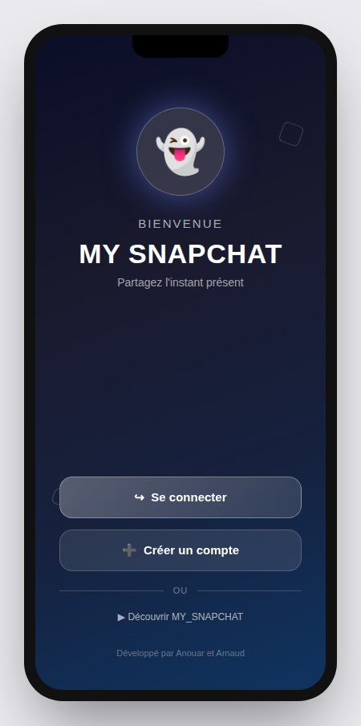

# My Snapchat — React Native Snapchat Clone

<p align="right"><sub>🇬🇧 English (this page) · <a href="#fr">🇫🇷 Français</a> · <a href="#es">🇪🇸 Español</a></sub></p>

*Built between June 4–10, 2025, as a team project with Arnaud Mazoire, at Epitech Web Academy.*

The exercise: clone Snapchat's core loop in React Native — camera, ephemeral photo messages, stories, friends, chat.



## What it does

- **Auth** — sign up (email, username, password, birthdate) and log in against a REST backend
- **Camera** — native camera with flash toggle, front/back mirroring, and picking a photo from the gallery instead
- **Ephemeral snaps** — pick a display duration (1 to 10 seconds) before sending a photo to a friend
- **Friends** — browse and add friends to send snaps to
- **Messages** — received snaps with an unread badge, auto-marked as seen once viewed, disappearing after
- **Stories** — a stories tab alongside camera and chat, tied together by a bottom nav
- **Profile** — edit your info and profile picture

## What's in this repo

- **[`my_snapchat/`](my_snapchat)** — the Expo / React Native app. Screens under `src/screens` (`WelcomeScreen`, `LoginScreen`, `SignUpScreen`, `ProfileScreen`, the `Home` tab with `CameraPageComponent` / `ChatPageComponent` / `StoriesPageComponent`), API client in `src/services/ApiService.ts`, auth state in `src/contexts/AuthContext.tsx`.

## How to run it locally

```bash
cd my_snapchat
npm install
npx expo start
```

The app talks to a REST backend (endpoints for `/user`, `/user/friends`, `/snap`, see `src/constants/Config.ts`) — the original one was a shared instance run for the course and isn't public, so you'll need to point `API_BASE_URL` / `API_KEY` at your own backend implementing the same routes to actually log in and send snaps. Without one, the UI still runs and navigates, but network calls will fail.

## A note on this repo's history

This public copy carries the real commit history from the original private (Epitech-org) repo — nothing squashed. Two things were scrubbed before publishing, since neither belonged here:

- **A live API key.** `ApiService.ts` (and the original README) had a real JWT hardcoded as the API key for the course's shared backend. It's been replaced with `REDACTED_API_KEY` across every commit that touched it, not just the latest one.
- **A stock video.** `assets/videos/VideoSnapHome.mp4`, used as the welcome screen's background, was footage of two identifiable people that had nothing to do with this project (stock/found footage, not ours to publish) — removed from the full history. `VideoBackground.tsx` still does `require('../../assets/videos/VideoSnapHome.mp4')`, so bundling will fail until you either drop your own `.mp4` at that path or swap the `<Video>` block for the gradient overlay that's already rendered underneath it.

## Team

Built with **Arnaud Mazoire** ([ArnaudMzz](https://github.com/ArnaudMzz)) — he built the camera (flash, mirroring, gallery picker) and the profile screens; I set up the project structure, Babel/Metro config, and the auth/registration flow.

## Stack

React Native 0.79, Expo 53, TypeScript, React Navigation, Expo Camera, Expo AV, Expo Blur, Expo Linear Gradient, React Native Animatable, Axios, AsyncStorage.

---

<a id="fr"></a>
<details>
<summary>🇫🇷 Français</summary>

# My Snapchat — Clone de Snapchat en React Native

*Réalisé entre le 4 et le 10 juin 2025, en binôme avec Arnaud Mazoire, à Epitech Web Academy.*

L'exercice : reproduire le cœur de Snapchat en React Native — caméra, messages photo éphémères, stories, amis, chat.

## Ce que ça fait

- **Authentification** — inscription (email, username, mot de passe, date de naissance) et connexion sur un backend REST
- **Caméra** — caméra native avec flash, bascule avant/arrière, et sélection d'une photo depuis la galerie
- **Snaps éphémères** — choisir une durée d'affichage (1 à 10 secondes) avant d'envoyer une photo à un ami
- **Amis** — parcourir et ajouter des amis pour leur envoyer des snaps
- **Messages** — snaps reçus avec badge de non-lus, marqués automatiquement comme vus, puis disparaissant
- **Stories** — un onglet stories aux côtés de la caméra et du chat, réunis par une barre de navigation
- **Profil** — modifier ses informations et sa photo de profil

## Ce que contient ce repo

- **[`my_snapchat/`](my_snapchat)** — l'application Expo / React Native. Les écrans dans `src/screens` (`WelcomeScreen`, `LoginScreen`, `SignUpScreen`, `ProfileScreen`, l'onglet `Home` avec `CameraPageComponent` / `ChatPageComponent` / `StoriesPageComponent`), le client API dans `src/services/ApiService.ts`, l'état d'authentification dans `src/contexts/AuthContext.tsx`.

## Comment le lancer en local

```bash
cd my_snapchat
npm install
npx expo start
```

L'appli parle à un backend REST (routes `/user`, `/user/friends`, `/snap`, voir `src/constants/Config.ts`) — celui d'origine était une instance partagée pour le cours et n'est pas public, il faut donc pointer `API_BASE_URL` / `API_KEY` vers votre propre backend implémentant les mêmes routes pour vraiment se connecter et envoyer des snaps. Sans ça, l'interface tourne et navigue quand même, mais les appels réseau échouent.

## Une précision sur l'historique de ce repo

Cette copie publique garde le véritable historique de commits du repo privé original (organisation Epitech) — rien n'a été squashé. Deux choses ont été retirées avant publication, car elles n'avaient rien à faire là :

- **Une clé API réelle.** `ApiService.ts` (et le README d'origine) contenaient un vrai JWT en dur comme clé API pour le backend partagé du cours. Il a été remplacé par `REDACTED_API_KEY` dans tous les commits concernés, pas seulement le dernier.
- **Une vidéo stock.** `assets/videos/VideoSnapHome.mp4`, utilisée en fond de l'écran d'accueil, montrait deux personnes identifiables sans rapport avec ce projet (vidéo stock/trouvée, pas la nôtre à publier) — retirée de tout l'historique. `VideoBackground.tsx` fait toujours `require('../../assets/videos/VideoSnapHome.mp4')`, donc le bundling échouera tant que vous n'aurez pas déposé votre propre `.mp4` à cet endroit, ou remplacé le bloc `<Video>` par le dégradé déjà affiché en dessous.

## Équipe

Réalisé avec **Arnaud Mazoire** ([ArnaudMzz](https://github.com/ArnaudMzz)) — il a fait la caméra (flash, miroir, sélecteur de galerie) et les écrans de profil ; j'ai fait la structure du projet, la config Babel/Metro, et le flux d'authentification/inscription.

## Stack

React Native 0.79, Expo 53, TypeScript, React Navigation, Expo Camera, Expo AV, Expo Blur, Expo Linear Gradient, React Native Animatable, Axios, AsyncStorage.

</details>

<a id="es"></a>
<details>
<summary>🇪🇸 Español</summary>

# My Snapchat — Clon de Snapchat en React Native

*Realizado entre el 4 y el 10 de junio de 2025, en equipo con Arnaud Mazoire, en Epitech Web Academy.*

El ejercicio: reproducir el núcleo de Snapchat en React Native — cámara, mensajes de foto efímeros, stories, amigos, chat.

## Qué hace

- **Autenticación** — registro (email, username, contraseña, fecha de nacimiento) y login contra un backend REST
- **Cámara** — cámara nativa con flash, espejo frontal/trasera, y elegir una foto de la galería en su lugar
- **Snaps efímeros** — elegir una duración de visualización (1 a 10 segundos) antes de enviar una foto a un amigo
- **Amigos** — explorar y agregar amigos para enviarles snaps
- **Mensajes** — snaps recibidos con badge de no leídos, marcados automáticamente como vistos, y luego desaparecen
- **Stories** — una pestaña de stories junto a la cámara y el chat, unidas por una barra de navegación inferior
- **Perfil** — editar tu info y foto de perfil

## Qué hay en este repo

- **[`my_snapchat/`](my_snapchat)** — la app de Expo / React Native. Las pantallas en `src/screens` (`WelcomeScreen`, `LoginScreen`, `SignUpScreen`, `ProfileScreen`, la pestaña `Home` con `CameraPageComponent` / `ChatPageComponent` / `StoriesPageComponent`), el cliente de API en `src/services/ApiService.ts`, el estado de autenticación en `src/contexts/AuthContext.tsx`.

## Cómo correrlo en local

```bash
cd my_snapchat
npm install
npx expo start
```

La app habla con un backend REST (rutas `/user`, `/user/friends`, `/snap`, ver `src/constants/Config.ts`) — el original era una instancia compartida para el curso y no es público, así que hay que apuntar `API_BASE_URL` / `API_KEY` a tu propio backend que implemente las mismas rutas para poder loguearte y enviar snaps de verdad. Sin eso, la interfaz igual corre y navega, pero las llamadas de red fallan.

## Una aclaración sobre el historial de este repo

Esta copia pública mantiene el historial de commits real del repo privado original (organización de Epitech) — nada fue aplastado en un solo commit. Se retiraron dos cosas antes de publicar, porque no tenían nada que hacer ahí:

- **Una API key real.** `ApiService.ts` (y el README original) tenían un JWT real hardcodeado como API key del backend compartido del curso. Se reemplazó por `REDACTED_API_KEY` en todos los commits que lo tocaban, no solo el último.
- **Un video de stock.** `assets/videos/VideoSnapHome.mp4`, usado como fondo de la pantalla de bienvenida, mostraba a dos personas identificables sin relación con este proyecto (video de stock/encontrado, no nuestro para publicar) — eliminado de todo el historial. `VideoBackground.tsx` todavía hace `require('../../assets/videos/VideoSnapHome.mp4')`, así que el bundling va a fallar hasta que pongas tu propio `.mp4` en esa ruta, o reemplaces el bloque `<Video>` por el degradado que ya se renderiza debajo.

## Equipo

Realizado con **Arnaud Mazoire** ([ArnaudMzz](https://github.com/ArnaudMzz)) — hizo la cámara (flash, espejo, selector de galería) y las pantallas de perfil; yo hice la estructura del proyecto, la config de Babel/Metro, y el flujo de autenticación/registro.

## Stack

React Native 0.79, Expo 53, TypeScript, React Navigation, Expo Camera, Expo AV, Expo Blur, Expo Linear Gradient, React Native Animatable, Axios, AsyncStorage.

</details>

